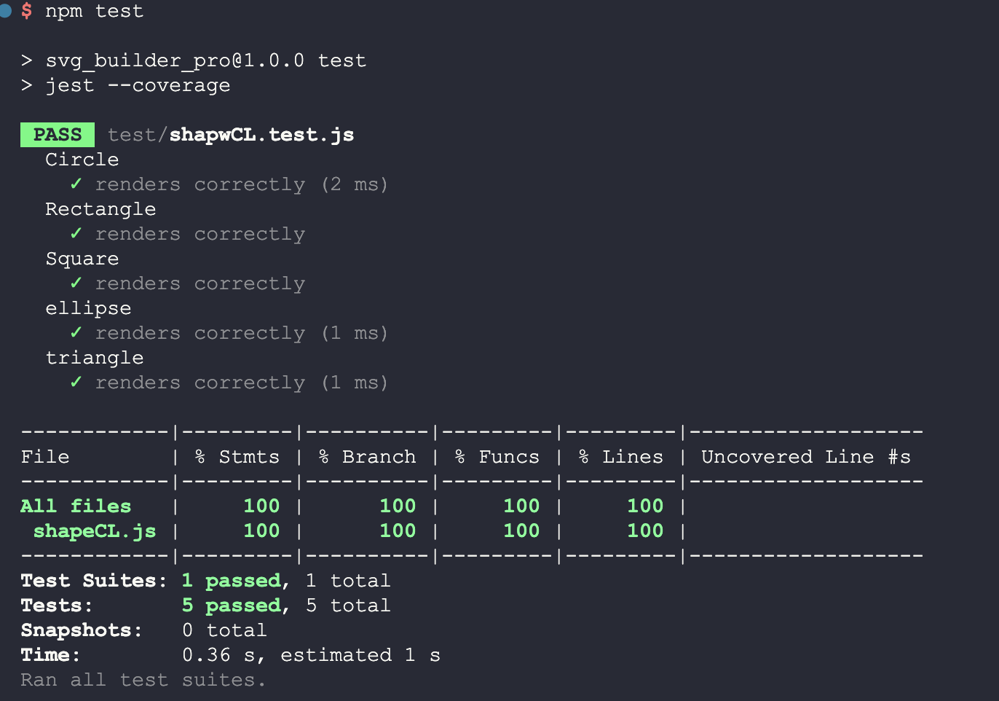

# Build Your Own SVG
  
  ## Description:
  The main goal of this project is to build a Node.js command-line application that takes in user inputs to generate a logo and save it as an SVG file. The applications prompts the user to select a color and shape, provide text for the logo, and save the generated SVG to a .svg file. After completion of the project, I have a better understanding of Inquirer, Scalable Vector Graphics, and asynchronous functions. I also learned how to use Jest, a unit testing framework, and enjoyed the ability to test locally and view the results to improve production efficiency. And lastly I sure learned .gitignore after remaking this repo a few times to prevent the node modules folder.
  
  ## Table of Contents:
  - [Installation Instructions](#Installation-Instructions)
  - [Usage Information](#Usage-Instructions)
  - [Links](#Links)
  - [Features](#Features)
  - [Test Instructions](#Test-Instructions)
  - [License](#License)
  - [Questions](#Questions)

  ## Installation Instructions:
  Step 1: Clone repository
   
  Step 2: Install Nodejs 
   
  Step 3: Install a source-code editor like VsCode
  
  ## Usage Instructions:
  Step 1: Open in VsCode(preferred) or another source-code editor 
   
  Step 2: Open integrated terminal once in the main main folder 
   
  Step 3: "run npm i" / "sudo npm i" in the terminal to install the required dependencies. 
   
  Step 4: Now to run the file, Enter "npm run start" or "node index.js"
   
  Step 5: The appliction will run and user will be presented with a series of inquirer questions inside the command line interface.
   
  Step 6: Once completed, user will be notified within the cmd terminal thus creating the "logo.svg." Feel free to rename.

  ## Links
  Screenshots:
  

  Youtube:
  [Youtube link](https://www.youtube.com)

  ## Features
  Javascript variables, destructuring, async/await functions, etc.

  ## Test Instructions:
  Run npm test for Jest testing. A coverage file is also provided for additional testing data.
  
  ## License:
  
  Licensed under the The MIT License license.
  
    (https://opensource.org/licenses/MIT)
  
  ## Questions:
  For additonal questions or concerns, feel free to contact me via [prismhead26@gmail.com](http://prismhead26@gmail.com). 
  You can also find me on Github at [prismhead26](https://github.com/prismhead26).
  
  © 2024 Aiden Wahed. All Rights Reserved.